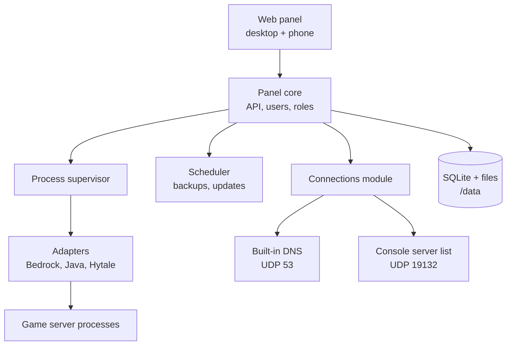

# Blockheads Control Panel: Product Design

A free, open-source, all-in-one panel for hosting Minecraft (Bedrock and Java), Hytale and similar game servers at home, with console joining, DNS, users and backups built in. Name: Blockheads Control Panel.

## What it is

One Docker container that runs several game servers and everything needed to reach them: a web panel for desktop and phone, a tiny DNS server, and a console server list. A parent should be able to go from install to kids playing on Xbox in under 15 minutes, without ever opening a config file.

**Goals**

- Every everyday setting is a labelled control with a plain-English explanation. Raw config files stay reachable but are never required.
- Consoles (Xbox, PlayStation, Switch) can join with no extra software, at home and optionally from friends' houses.
- Updates can't leave a server unable to start: permissions, backups and restarts are handled for you.
- Several people can log in, each seeing only what their role allows.
- Supports the server types Crafty Controller does, through a plug-in adapter per type.
- Free and open source on GitHub.

**Non-goals**

- Commercial hosting features: billing, many machines, reselling.
- Replacing Unraid, Docker or the router. The panel tells you what to change on the router; it doesn't change it.

## First-run setup and network modes

The first time the panel opens, a five-step wizard sets everything up. One question drives most of the configuration: **where will people play from?**

1. **Create the owner account** (name and password).
2. **Where will people play from?** Home only, or home and friends' houses.
3. **Check the network.** The panel detects its LAN address and, for friends mode, asks for a public address or domain (for example `mc.atomikgroove.net`).
4. **Import or create servers.** Scan a folder for existing servers (Crafty, plain folders) or start from a template.
5. **Show the to-do list.** Router ports to forward, and the one DNS setting to change on the router or each console.

|  | Home only | Home and friends |
| --- | --- | --- |
| Who can join | Devices on your network | Also friends on the internet |
| Built-in DNS answers | LAN devices only | LAN devices; internet queries only for the 6 console redirect names |
| Console list points to | Panel's LAN IP | LAN IP at home, public address for outside queries |
| Router changes | None | Forward the ports on the Connections page |
| Allowlist default | Off | On, and required for internet-facing servers |
| Xbox sign-in (online mode) | On | On, locked |

The mode can be changed later on the Connections page. Each server can also opt out of friends mode, so a family creative world stays home-only while the survival server is reachable.

## Users and roles

Four built-in roles. Every role except Owner and Admin is granted **per server**, so a kid can run their own world without touching anyone else's.

| Can… | Owner | Admin | Server manager | Player |
| --- | --- | --- | --- | --- |
| See servers they're assigned | All | All | Assigned | Assigned |
| Start, stop, restart | Yes | Yes | Yes | Start only (optional) |
| Approve players, edit allowlist | Yes | Yes | Yes | No |
| Use the console | Yes | Yes | Yes | No |
| Change game settings | Yes | Yes | Yes | No |
| Update, back up, restore | Yes | Yes | Back up only | No |
| Add or delete servers | Yes | Yes | No | No |
| Network, DNS, ports | Yes | Yes | No | No |
| Manage users | Yes | Yes, except Owner | No | No |

- **Player** is the kid-friendly role: see if a server is up, who's online, and press Start when it's stopped.
- An **activity log** records who did what ("Ava stopped Ava's Server, 7:42 PM").
- Sign-in is username and password, with optional two-factor codes for Owner and Admin. Passkeys can come later.

## Features by screen

The design mockups show these screens. On a phone, the sidebar becomes a bottom tab bar and each server page becomes a stack of cards.

| Screen | What you can do | Phone priority |
| --- | --- | --- |
| Servers | Status, players online, version, port, who can reach it; start, stop, update; conflict warnings with one-click fixes | High |
| Settings | Every common setting as a labelled control; changes held until saved; restart now or later; raw file editor as an escape hatch | Medium |
| Players | Allowlist, roles, skip-player-limit, kick, message; "tried to join" list with one-tap Allow | High |
| Console | Live log with filters, command box with suggestions, quick actions (make it day, clear weather, back up) | Medium |
| Updates and backups | Installed vs latest version, safe update, automatic updates when empty; backup schedule, restore, download | Medium |
| Connections | Network mode, console server list order, built-in DNS status, router checklist, outside reachability check | Low |
| Users | Invite, assign roles per server, reset passwords, activity log | Low |

**How settings avoid config files.** Each server type ships a settings schema: key, label, help text, control type, allowed values, whether a restart is needed. The panel reads the real file, shows known keys as controls, and writes back only changed lines, keeping comments and unknown keys. Changes that can apply live (allowlist, roles) go through the server's own commands instead of a restart.

## Server types and the adapter model

The core panel knows nothing about any one game. Each server type is an **adapter**: a small module that answers the same questions, so adding a game never means changing the core.

| An adapter defines | Bedrock example | Java example |
| --- | --- | --- |
| How to install and update | Download the zip from Mojang's download API, keep settings and worlds, set the execute bit | Download the jar for the chosen loader and version; pick the right Java runtime |
| How to start and stop | `./bedrock_server`, stop with `stop` | `java -Xmx… -jar server.jar nogui`, stop with `stop` |
| Settings schema | `server.properties` keys, labels, help | `server.properties` keys (different set) |
| Access control | `allowlist add`, `permissions.json` | `whitelist add`, `op` |
| Reading the log | Started, player joined or left, turned away | Same events, different log lines |
| Status check | From the log (NetherNet has no simple ping) | Server list ping on the game port |
| Ports needed | Game port (TCP + UDP for NetherNet) | Game port (TCP) |

**Planned types**, matching what Crafty Controller supports today:

| Type | Variants | Phase |
| --- | --- | --- |
| Minecraft Bedrock | Official dedicated server | 1 |
| Minecraft Java | Vanilla, Paper, Purpur | 2 |
| Minecraft Java, modded | Fabric, Forge, NeoForge | 3 |
| Minecraft Java proxies | Velocity, BungeeCord | 3 |
| Hytale | Official server (Crafty added this in 4.9.0) | 3 |
| Steam games | Via SteamCMD, one adapter per game | 4 |

Java needs several Java runtimes (older versions need 17, newer need 21 or 25). The container ships them and the adapter picks the right one per server, so users never choose a Java version.

The Bedrock-only pieces (built-in DNS, console server list) are optional modules. Someone running only Java servers never sees them.

## Architecture

Everything runs in one container as one main program that supervises the game servers as child processes. There is one server list, one settings store and one place that writes config files, so nothing drifts out of sync.

The panel core is the only writer of configuration: saving a setting updates the server's file, the console list, the DNS answers and the router checklist together.

**Built-in DNS.** A tiny DNS server with two jobs:

- Answer the 6 featured-server names (The Hive, Lifeboat and others) with the console server list's address, so consoles land on your list.
- For devices on your network only, forward every other lookup to a normal upstream DNS (1.1.1.1 by default), so a console can use the panel as its only DNS.

Queries from the internet get answers for the 6 names and a refusal for everything else, so the server can't be abused as an open resolver. Rate limiting per address is on by default.

**Console server list.** Built into the panel in Go, replacing BedrockConnect. It uses [gophertunnel](https://github.com/Sandertv/gophertunnel) for the Minecraft protocol and [go-nethernet](https://github.com/df-mc/go-nethernet) for the newer connection type. It shows a menu of your servers and transfers the console to the one picked. A **connection setting** chooses what it offers consoles:

| Setting | Offers | When to use |
| --- | --- | --- |
| RakNet (default) | The older connection type | Works on consoles today (tested on Switch) |
| NetherNet | The newer connection type | If consoles stop falling back to RakNet |
| Both, per name | NetherNet only for chosen featured-server names, RakNet for the rest | Testing NetherNet on one name (for example Galaxite) without breaking the others |

## How consoles reach your servers

Consoles can't type in a server address, so the panel offers three ways in, each with its own on/off switch. The redirect is the default because it needs no friend requests or extra accounts. The other two are backups that don't depend on it.

| Method | How it works | Home | Friends outside | Needs |
| --- | --- | --- | --- | --- |
| Featured-server redirect (default) | Built-in DNS sends the featured-server names to the panel's server list | Yes | Yes | Console DNS set to the panel |
| LAN broadcast | Each server appears under Friends → LAN Games, using the NetherNet discovery built into go-nethernet | Yes | No | Nothing |
| Friends-tab broadcast | A dedicated Xbox account signed into the panel appears as "playing"; kids add it as a friend and join from the Friends tab, as [go-mcxboxbroadcast](https://pkg.go.dev/github.com/HashimTheArab/go-mcxboxbroadcast) and MCXboxBroadcast do | Yes | Yes | One extra Microsoft account |

If Minecraft ever breaks the redirect for good, consoles keep access through the other two. PCs and phones join directly and are never affected.

## Ports and deployment

| Port | Protocol | Used for | Needed when |
| --- | --- | --- | --- |
| 8443 | TCP (HTTPS) | Web panel | Always |
| 53 | UDP + TCP | Built-in DNS | Consoles join Bedrock servers |
| 19132 | UDP | Console server list | Consoles join Bedrock servers |
| One per server (e.g. 19144) | TCP + UDP | Bedrock game servers | Per server |
| 49152–49200 | UDP | Bedrock NetherNet gameplay | Friends mode, Bedrock |
| One per server (e.g. 25565) | TCP | Java game servers | Per server |

Ports 53 and 19132 are fixed: consoles only look there. That's why the container works best with **its own IP address** on the home network.

- **Unraid:** a Community Apps template on `br0` with a fixed IP (the way BedrockConnect runs on 10.0.1.116 today). Appdata in one folder; `PUID`/`PGID` default to 99/100.
- **Docker on Linux:** host networking, or macvlan for a dedicated IP. A compose file ships for each.
- **Docker Desktop (Windows, Mac):** panel and game servers work; built-in DNS and the console list need a dedicated IP, so the setup wizard explains the trade-off.

The wizard checks whether 53 and 19132 are free and says exactly what's using them if not (for example, Pi-hole or AdGuard already on port 53).

## Security

The panel controls servers kids play on and can be reached from outside, so safe defaults matter more than options.

- **Panel access:** HTTPS always (self-signed by default, bring-your-own certificate or a reverse proxy supported). Home-only by default; exposing the panel to the internet is a separate, clearly warned setting from letting friends play.
- **Accounts:** passwords hashed with Argon2, lockout after repeated failures, optional two-factor for Owner and Admin, sessions that expire.
- **Game servers:** internet-facing servers can't have the allowlist or Xbox sign-in turned off without a warning, and the dashboard flags any that do.
- **DNS:** never an open resolver (see Architecture). Answers only the 6 redirect names to the internet, with rate limits.
- **Files:** each server runs as the container's user with no root access. The panel never needs the Docker socket, because it doesn't create containers.
- **Updates:** game servers download only from each game's official source, with checksums where the source provides them.

## Tech stack and license

**Decided: a Go backend with a Svelte web front end, stored in SQLite, shipped as one Docker image.**

| Piece | Choice | Why |
| --- | --- | --- |
| Panel core | Go | One small binary with no runtime to install; good at supervising many processes and streaming logs; low memory next to the game servers |
| Built-in DNS | Go DNS library inside the core | No extra process; only a few hundred lines to answer 6 names and forward LAN queries |
| Console server list | Go Bedrock libraries, such as [go-nethernet](https://github.com/df-mc/go-nethernet) (MIT, still in development) | Replaces BedrockConnect with gophertunnel (MIT); proven on a Switch |
| Web front end | Svelte, built to static files the core serves | Small, fast on phones, one responsive codebase for desktop and mobile |
| Storage | SQLite plus the servers' own files in `/data` | Nothing extra to run; one folder to back up |
| Runtimes in the image | Java 17, 21 and 25 | Covers every Java server version |

Python (FastAPI) was the main alternative: more hobbyists can contribute, but it needs a runtime and more memory, and the proven server list is already Go.

**License: GPL-3.0 (decided).** Anyone may use, change and share the panel, and anyone who distributes a modified version must publish it under GPL-3.0 too, so improvements flow back. All libraries used so far (MIT and BSD) are compatible. Minecraft server software itself is never redistributed; each server downloads it from the official source on the user's machine, which keeps the project clear of Mojang's EULA.

## Proof-of-concept results

The built-in DNS and server list were tested on a Nintendo Switch (Minecraft 1.26.50) on 2026-09-26. The redirect works end to end over RakNet.

| Question | Result |
| --- | --- |
| Does the built-in DNS catch the featured-server names? | Yes. The Switch looks up all of them when Minecraft opens |
| Is Xbox sign-in verified? | Yes: gamertag and XUID arrive signed |
| Does the menu work, and does the transfer reach the chosen server? | Yes, including transfers to NetherNet game servers such as Blockheads |
| Is there a trust prompt? | Yes, once per game server, from the game server (it uses NetherNet), not from the list. Guides must tell players to accept it, or the join times out |
| With RakNet only, does the Switch use it? | Yes, every time |
| With NetherNet offered, does it work? | No. The Switch rejects our certificate over HTTPS, since a valid one for another company's domain is impossible. It pings over plain HTTP to fill in the server tile, but always joins over RakNet. Offering NetherNet on one name (Galaxite) broke nothing; the Switch fell back to RakNet cleanly. A NetherNet-only redirect likely can't work for anyone |
| How long does the menu take to appear? | About 19 seconds on the Switch, against 32 for the public BedrockConnect server. The load timeline shows the Switch finishes the handshake in 2 seconds and spends the rest on its own world loading, so this is the Switch, not a bug |

Also learned: after changing a console's DNS, restart the console, or it keeps using old answers. Next tests: Xbox and PlayStation, with default settings.

## Risks and open questions

| Risk | Why it matters | Plan |
| --- | --- | --- |
| Consoles stop using the old RakNet connection for featured servers | The redirect works over RakNet today, and NetherNet can't complete it (see results). Mojang is moving Bedrock to [NetherNet](https://support.aternos.org/hc/en-us/articles/39155890785053-NetherNet-protocol-Minecraft-Bedrock-Edition), and dedicated servers already dropped RakNet in 26.60. If consoles follow, the redirect breaks for everyone, BedrockConnect included | LAN broadcast and Friends-tab broadcast are the real fallback, since a NetherNet redirect needs a valid certificate for the featured server's domain; keep the NetherNet test lane to recheck after Minecraft updates |
| Mojang changes the Bedrock download API | Updates would fail | Adapter falls back to a manual upload; clear error on the dashboard |
| Home ISPs block incoming port 53 | Friends mode's DNS won't work from outside | Wizard tests it; friends can use a public BedrockConnect DNS instead, as the current guide does |
| Port 53 already in use (Pi-hole, AdGuard) | Built-in DNS can't start | Dedicated container IP; or turn off built-in DNS and show the 6 records to add to the existing DNS server |
| Minecraft EULA | Servers must not run until the user accepts it | Wizard shows the EULA link and records acceptance before the first server starts |
| Hytale server details | Early-access and changing | Confirm install and config format before building its adapter |

**Decisions**

- [x] Project name: Blockheads Control Panel.
- [x] Language: Go (with a Svelte web front end).
- [x] License: GPL-3.0.
- [x] Importing existing Crafty servers is part of phase 1.
- [ ] Should Player accounts be able to start a stopped server, or only view status? (Open.)

## Roadmap

Each phase is usable on its own, so a family can switch off Crafty after phase 1.

| Phase | Delivers | Done when |
| --- | --- | --- |
| 1. Bedrock at home | Setup wizard, Bedrock adapter, dashboard, settings, players, console, safe updates, backups, built-in DNS and native server list (RakNet), owner account, phone layout, Crafty import | Six Bedrock servers run from the panel and consoles join from the list at home |
| 2. Friends and family | Friends mode, router checklist and outside check, users and roles, activity log, LAN broadcast, Java adapter (Vanilla, Paper, Purpur) | Friends join from outside; a kid logs in and runs only their own server |
| 3. More games | Fabric, Forge, NeoForge, proxies, Hytale, mod and plugin management, Friends-tab broadcast, Unraid Community Apps template | A modded Java server and a Hytale server run next to Bedrock |
| 4. Future-proofing | NetherNet server list (once consoles need it), Steam games via SteamCMD, passkeys, translations | Consoles still join if RakNet goes away |

The GitHub repo starts in phase 1 with a README, contributing guide, issue templates and this design as `docs/design.md`.

## Sources

- [BedrockConnect](https://github.com/Pugmatt/BedrockConnect): GPL-3.0, Java
- [BedrockConnect: using your own DNS server](https://github.com/Pugmatt/BedrockConnect/wiki/Using-your-own-DNS-server): the featured-server names to redirect
- [go-nethernet](https://github.com/df-mc/go-nethernet): MIT, NetherNet listener in Go
- [Aternos: NetherNet protocol](https://support.aternos.org/hc/en-us/articles/39155890785053-NetherNet-protocol-Minecraft-Bedrock-Edition): 26.60 removes RakNet from dedicated servers
- [WaterdogPE: NetherNet configuration](https://docs.waterdog.dev/waterdogpe-setup/nethernet-configuration): signaling over TCP, gameplay over WebRTC
- [Crafty Controller 4.9.0 release](https://www.spigotmc.org/resources/crafty-controller.80852/update?update=626638): Hytale support
- [Bedrock server update script](https://www.howgeek.com/2025/07/30/minecraft-linux-server-auto-update/): Mojang's download API and which files to keep
